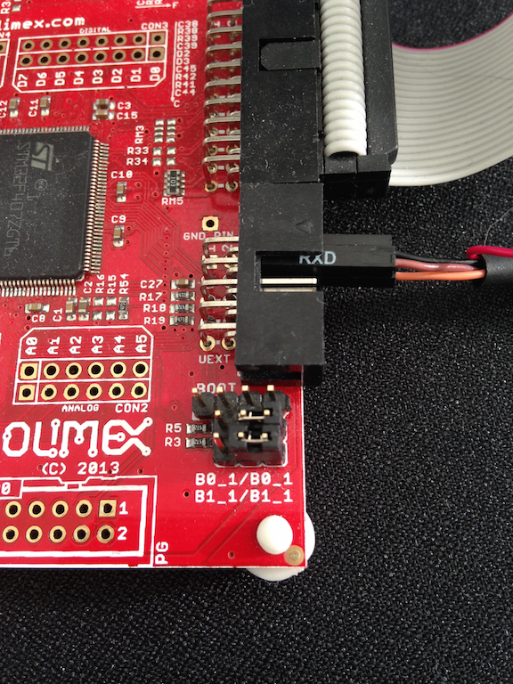

## Project Slinky 


### Objective

The goal of the project is to enable and demonstrate remote communications with the Mynewt OS via newt manager (newtmgr). We will do this through a project with Mynewt called Slinky that runs on the STM32-E407 board.

### What you need

1. STM32-E407 development board from Olimex. You can order it from [http://www.mouser.com](http://www.mouser.com/ProductDetail/Olimex-Ltd/STM32-E407/?qs=UN6GZl1KCcit6Ye0xmPO4A%3D%3D), [http://www.digikey.com](http://www.digikey.com/product-detail/en/STM32-E407/1188-1093-ND/3726951), and other places.
2. ARM-USB-TINY-H connector with JTAG interface for debugging ARM microcontrollers (comes with the ribbon cable to hook up to the board)
3. USB A-B type cable to connect the debugger to your personal computer
4. A USB to TTL Serial Cable with female wiring harness. An example is [http://www.amazon.com/JBtek®-WINDOWS-Supported-Raspberry-Programming/dp/B00QT7LQ88/ref=lp_464404_1_9?s=pc&ie=UTF8&qid=1454631303&sr=1-9](http://www.amazon.com/JBtek®-WINDOWS-Supported-Raspberry-Programming/dp/B00QT7LQ88/ref=lp_464404_1_9?s=pc&ie=UTF8&qid=1454631303&sr=1-9)
5. Personal Computer

The instructions assume the user is using a Bourne-compatible shell (e.g. bash or zsh) on your computer. The given instructions have been tested with the following releases of operating systems:

* Mac: OS X Yosemite Version 10.10.5

### Overview of steps

* Install dependencies
* Define a target using the newt tool
* Build executables for the targets using the newt tool
* Set up serial connection with the targets 
* Create a connection profile using the newtmgr tool
* Use the newtmgr tool to communicate with the targets

### Install newt

If you have not already installed `newt`, see the 
[newt installation instructions](../newt/install/newt_mac.md) and ensure newt is installed an in your path.

### Install newtmgr

If you have not already installed `newtmgr`, see the 
[newtmgr installation instructions](installing.md) and ensure newtmgr is installed an in your path.

### Create a new project

Instructions for creating a project are located in the [Getting Started](../os/get_started/project_create.md) section of the [Mynewt OS Manual](../os/get_started/introduction.md).

If you already completed [sim slinky](project-slinky.md) you can skip this step.

We will list only the steps here for brevity.  We will name the project
`slinky`.

```no-highlight
$ newt new slinky
Downloading project skeleton from apache/incubator-mynewt-blinky...
...
Installing skeleton in slink...
Project slink successfully created
$ cd slinky
$newt install -v
Downloading repository description for apache-mynewt-core... success!
...
Repos successfully installed
```

<br>

### Set up your target builds

Create a target for `stm32_slinky` using the native bsp.  See 
[How to Define a Target](../newt/tutorials/define_target.md) for a detailed
description.  The tool output is suppressed below for brevity.

```no-highlight
$ newt target create stm32_slinky
$ newt target set stm32_slinky bsp=@apache-mynewt-core/hw/bsp/olimex_stm32-e407_devboard
$ newt target set stm32_slinky build_profile=debug
$ newt target set stm32_slinky app=@apache-mynewt-core/apps/slinky
```

Create a second target for `stm32_bootloader` to build a bootloader to boot
the `stm32_slinky` image.  The tool output is suppressed below for brevity.

```no-highlight
$ newt target create stm32_bootloader
$ newt target set stm32_bootloader bsp=@apache-mynewt-core/hw/bsp/olimex_stm32-e407_devboard
$ newt target set stm32_bootloader build_profile=optimized
$ newt target set stm32_bootloader target.app=@apache-mynewt-core/apps/boot
```

<br>

### Build Targets

```no-highlight
$ newt build stm32_slinky
Compiling main.c
...
Linking slinky.elf
App successfully built: ~/dev/slinky/bin/stm32_slinky/apps/slinky/slinky.elf
```

```no-highlight
newt build stm32_bootloader
Compiling crc16.c
...
Linking boot.elf
App successfully built: ~/slinky/bin/stm32_bootloader/apps/boot/boot.elf
```

For the main image, you need to create an image using newt create-image.
Give this image some arbitrary version number "1.2.3".

```no-highlight
$ newt create-image stm32_slinky 1.2.3
App image succesfully generated: /Users/paulfdietrich/dev/slinky/bin/stm32_slinky/apps/slinky/slinky.img
Build manifest: /Users/paulfdietrich/dev/slinky/bin/stm32_slinky/apps/slinky/manifest.json
```

<br>

### Using newtmgr with a remote target 

* First make sure the USB A-B type cable is connected to the ARM-USB-TINY-H debugger connector on the Olimex board. 

     Next go the to project directory and download the slinky project image to the flash of the Olimex board. 

```no-highlight
$ newt load stm32_bootloader
$ newt load stm32_slinky
```

You can now disconnect the debugging cable from the board. You should see the green LED blinking. If not, try powercycling the board.

<br>

* Now you have to set up the serial connection from your computer to the Olimex board. Locate the PC6/USART6_TX (pin#3), PC7/USART6_RX (pin#4), and GND (pin#2) of the UEXT connector on the Olimex board. More information on the UEXT connector can be found at [https://www.olimex.com/Products/Modules/UEXT/](https://www.olimex.com/Products/Modules/UEXT/). The schematic of the board can be found at [https://www.olimex.com/Products/ARM/ST/STM32-E407/resources/STM32-E407_sch.pdf](https://www.olimex.com/Products/ARM/ST/STM32-E407/resources/STM32-E407_sch.pdf) for reference.

     


	* Connect the female RX pin of the USB-TTL serial cable to the TX of the UEXT connector on the board. 
	* Connect the female TX pin of the USB-TTL serial cable to the RX of the UEXT connector on the board. 
	* Connect the GND pin of the USB-TTL serial cable to the GND of the UEXT connector on the board.

<br>

* Locate the serial connection established in the /dev directory of your computer. It should be of the type `tty.usbserial-<some identifier>`.

```no-highlight
        $ ls /dev/tty.usbserial-AJ03HAQQ 
        /dev/tty.usbserial-AJ03HAQQ
```

<br>

* You now have to define a connection profile using newtmgr. You can give it any name you want. The example below shows the connection profile being named as the very imaginative `olimex01`.

```no-highlight
        $ pwd
        /Users/<user>/dev/larva/project/slinky
        $ newtmgr conn add olimex01 type=serial connstring=/dev/tty.usbserial-AJ03HAQQ 
        Connection profile olimex01 successfully added
        $ newtmgr conn show
        Connection profiles: 
          sim1: type=serial, connstring='/dev/ttys007'
          olimex01: type=serial, connstring='/dev/tty.usbserial-AJ03HAQQ'
```

<br>

* Now go ahead and query the Olimex board to get responses back. The simplest command is the `echo` command to ask it to respond with the text you send it. 

```no-highlight
    $ newtmgr echo -c olimex01 hello
    {"r": "hello"}
    $ newtmgr image -c olimex01 list
    Images:
        0 : 1.2.3
    $ newtmgr -c olimex01 taskstats
    Return Code = 0
      newtmgr (prio=4 tid=2 runtime=0 cswcnt=12 stksize=512 stkusage=255 last_checkin=0 next_checkin=0)
      task1 (prio=1 tid=3 runtime=0 cswcnt=299 stksize=128 stkusage=33 last_checkin=0 next_checkin=0)
      task2 (prio=2 tid=4 runtime=0 cswcnt=300 stksize=128 stkusage=31 last_checkin=0 next_checkin=0)
      idle (prio=255 tid=0 runtime=299916 cswcnt=313 stksize=32 stkusage=18 last_checkin=0 next_checkin=0)
      shell (prio=3 tid=1 runtime=1 cswcnt=20 stksize=384 stkusage=60 last_checkin=0 next_checkin=0)
```


